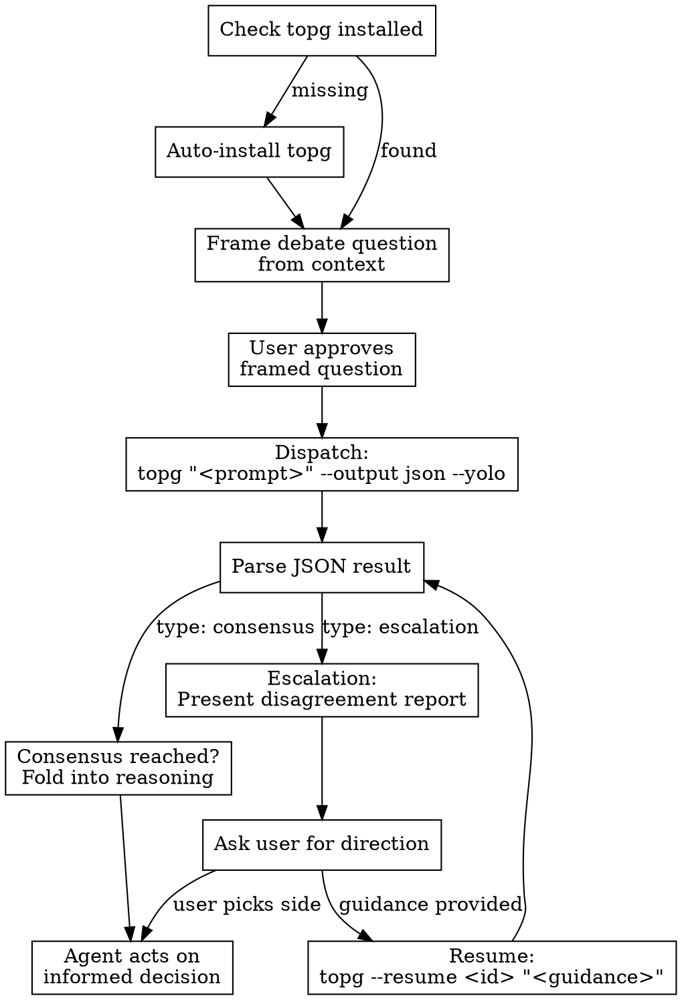

# topg-debate Skill — Design Specification

**Date:** 2026-03-23
**Status:** Draft
**Author:** Brainstorming session

## Overview

An installable Claude Code skill that enables any Claude Code session to dispatch multi-agent debates via the `topg` CLI. When Claude Code encounters architectural decisions, trade-off-heavy problems, subtle bugs, or situations where a second AI opinion would add value, this skill orchestrates a structured debate between Claude and Codex — then folds the consensus back into the invoking session's reasoning.

The skill manages the full debate lifecycle: installation checks, prompt framing, debate dispatch, result parsing, session resume on escalation, and multi-debate context tracking.

## Audience

Claude Code users working in codebases where complex decisions benefit from adversarial multi-agent deliberation. The skill is invoked by the Claude Code agent itself (explicitly or via auto-suggestion), not by external agent frameworks.

## Skill Identity

- **Name:** `topg-debate`
- **Description (CSO-optimized):** Use when facing architectural decisions, choosing between competing approaches, debugging subtle issues after initial attempts fail, reviewing security-sensitive code, designing public APIs, or when a second opinion from a different AI model would add value. Also use when user says "debate", "topg", "get a second opinion", or "multi-agent". Do not use for straightforward tasks with clear answers.

### Trigger Modes

- **Explicit:** User types `/topg` or mentions "debate this", "topg", "get a second opinion", "multi-agent"
- **Auto-suggest:** Claude Code recognizes qualifying situations and suggests invoking the skill. Qualifying situations include:
  - Architecture decisions with 2+ viable approaches
  - Debugging that has failed after initial attempts
  - Security-sensitive code review
  - Public API surface design
  - Trade-off-heavy decisions where both sides have merit

## Prerequisites & Auto-Install

When the skill triggers, it first ensures `topg` is available:

### Step 1: Check for topg

```bash
which topg
```

### Step 2: Install if missing

```bash
# Clone from GitHub
git clone https://github.com/eishan05/topgstack.git /tmp/topgstack-install
cd /tmp/topgstack-install

# Build and install globally
npm install
npm run build
npm install -g .

# Verify
topg --help

# Cleanup
rm -rf /tmp/topgstack-install
```

### Step 3: Verify prerequisites

- `topg --help` succeeds
- `OPENAI_API_KEY` is set (required for Codex agent) — warn if missing
- `claude` CLI is available (required for Claude agent) — should always be true in Claude Code context

If install fails, surface the error to the user with instructions rather than silently continuing.

## Core Workflow



### Phase 1: Frame the Question

Extract or formulate the debate prompt from the current conversation context:

- Include the specific decision or question to debate
- Attach relevant code snippets, file paths, and constraints
- Reference prior decisions or requirements that constrain the solution space
- Present the framed question to the user for approval before dispatching

**Example framed prompt:**
> "We need to decide between Redis and PostgreSQL for the caching layer. Constraints: must support TTL, current stack is all PostgreSQL, team has no Redis ops experience. The API serves ~10k RPM with 200ms p99 target. Should we add Redis or use PostgreSQL's built-in caching?"

### Phase 2: Dispatch Debate

Execute topg with JSON output and YOLO mode as defaults:

```bash
topg "<framed prompt>" \
  --output json \
  --yolo \
  --cwd "$(pwd)" \
  [additional flags from config]
```

While the debate runs, inform the user: "Debate in progress between Claude and Codex..."

The debate runs synchronously — the skill waits for the full result before continuing.

### Phase 3: Parse Result

The JSON output from topg contains:

```typescript
{
  type: "consensus" | "escalation";
  sessionId: string;
  rounds: number;
  summary: string;       // Formatted markdown
  messages: Message[];   // Full turn history
  artifacts?: Artifact[]; // Generated code/files
}
```

### Phase 4: Fold Into Reasoning

**If consensus (`type: "consensus"`):**
- Present the agreed approach with key reasoning from both agents
- The consensus INFORMS the invoking agent's subsequent actions — it doesn't replace the agent's own judgment
- If artifacts were generated, present them as suggested implementations
- Continue with the task, using the debate outcome as a strong signal

**If escalation (`type: "escalation"`):**
- Present the structured disagreement report:
  - Points both agents agreed on
  - Points of disagreement with each side's arguments
  - Each agent's final recommendation
- Ask the user which direction to take using AskUserQuestion
- Options: side with Claude's recommendation, side with Codex's recommendation, provide custom guidance to resume debate

## Session Management

### Active Session Tracking

The skill tracks the `sessionId` from each debate dispatch. This enables:

- **Resume after escalation:** Provide guidance to break a deadlock
- **Continue a topic:** Extend a prior debate with new information
- **Reference prior debates:** When framing new questions, cite outcomes from related past debates

### Resume with Guidance

When a debate escalates and the user provides direction:

```bash
topg --resume <sessionId> "<user guidance>" --output json --yolo
```

The resumed debate includes the user's guidance as additional context. The agents continue from where they left off with the new constraint. The skill parses the new result identically to the initial dispatch.

### Session Lifecycle Commands

The skill can manage sessions on behalf of the user:

- **List sessions:** Parse output from topg's session listing to show active/paused/completed debates
- **Clean up:** `topg clear --completed --older-than 7d` to prune old sessions
- **Delete specific:** `topg delete <sessionId>` for targeted cleanup

### Multi-Debate Context

For complex problems that spawn multiple debates:

- Track all sessionIds within the conversation
- When framing a new debate question, reference relevant prior debate outcomes
- Example: "In a previous debate (session abc123), we agreed on PostgreSQL for caching. Now we need to decide on the cache invalidation strategy."

## Configuration

### Default Flags (The Way)

| Flag | Default | Rationale |
|------|---------|-----------|
| `--yolo` | **ON** | Skip permission checks — that's the way |
| `--output` | `json` | Machine-parseable for agent consumption |
| `--start-with` | `claude` | Claude leads, Codex reviews |
| `--guardrail` | `5` | 5 rounds before escalation |
| `--timeout` | `900` | 15 min per agent turn |
| `--codex-sandbox` | `workspace-write` | Codex can write to project files |
| `--codex-web-search` | `live` | Full web search enabled |
| `--codex-network` | `true` | Network access enabled |
| `--no-dashboard` | ON | No web dashboard in skill mode (agent-only) |

### Full Config Passthrough

Every topg CLI flag is available for override. The invoking agent should adjust flags based on context:

- `--start-with codex` — when Codex might have better domain instincts (e.g., frontend, OpenAI ecosystem)
- `--guardrail 3` — for simpler decisions that shouldn't run long
- `--guardrail 8` — for deeply contentious architectural choices
- `--codex-sandbox read-only` — when the debate should only reason, not touch files
- `--codex-sandbox danger-full-access` — when agents need full system access to investigate
- `--codex-reasoning xhigh` — for complex problems requiring deep reasoning
- `--codex-model <model>` — to specify a particular Codex model

## File Structure

```
~/.claude/skills/topg-debate/
  SKILL.md                # Main skill: trigger logic, workflow, quick reference
  session-management.md   # Deep guide: resume, multi-debate, session lifecycle
  config-reference.md     # Full flag reference with per-scenario recommendations
```

### SKILL.md (~300 lines)

The main entry point. Contains:
- Frontmatter (name, description)
- Prerequisites check and auto-install flow
- Core workflow: frame → approve → dispatch → parse → fold
- Quick reference table of common invocations
- When to use / when NOT to use
- Escalation handling overview (links to session-management.md for details)

### session-management.md (~150 lines)

Deep reference for session lifecycle:
- Resume mechanics and guidance patterns
- Multi-debate context tracking
- Session browsing and cleanup
- Examples of multi-turn debate workflows

### config-reference.md (~100 lines)

Full flag reference with scenario-based recommendations:
- Flag table with types, defaults, and descriptions
- "Which flags for which scenario" quick-pick guide
- YOLO philosophy and when to deviate

## Error Handling

| Error | Handling |
|-------|----------|
| topg not installed, install fails | Surface error with manual install instructions |
| `OPENAI_API_KEY` not set | Warn user, suggest setting it, abort |
| topg times out (>15 min per turn) | Report timeout, offer to resume with tighter constraints |
| topg crashes mid-debate | Report error, session auto-paused, offer resume |
| JSON parse failure | Fall back to text output mode, re-run with `--output text` |
| All agents agree immediately (1 round) | Present result but flag low-confidence — may indicate the question was too simple for debate |

## Non-Goals

- **Not a replacement for the agent's own reasoning.** The debate result is advisory input, not an oracle.
- **Not for simple questions.** "What's the syntax for X?" doesn't need a debate.
- **Not for real-time pair programming.** This is deliberative, not interactive.
- **No embedded orchestration.** The skill delegates to the `topg` CLI, it doesn't re-implement orchestration logic.
- **No web dashboard integration.** The skill operates in CLI/JSON mode only — the dashboard is for human-driven sessions.
